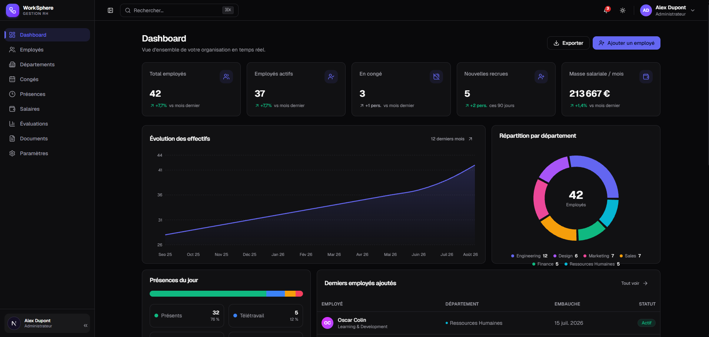

<p align="center">
  
</p>

# WorkSphere — Employee Management (HR)

> A modern, premium and fully responsive **human resources management** SaaS dashboard,
> built with **Next.js (App Router)**, **TypeScript**, **Tailwind CSS v4**, **shadcn/ui**,
> **Lucide Icons**, **Recharts** and **React Hook Form + Zod**.

All data is **fictional and local** (mocked) — there is no real database or backend. The data is
centralized in `data/` and persisted client-side (localStorage), which makes it easy to swap in a
real API later.

---

## 🚀 Installation & getting started

Prerequisites: **Node.js ≥ 20.9**.

```bash
# 1. Clone the project (or copy the folder)
git clone <your-repo> work-sphere
cd work-sphere

# 2. Install dependencies
npm install

# 3. Start the development server
npm run dev
```

Then open [http://localhost:3000](http://localhost:3000) 🎉

### Available scripts

| Command               | Description                                 |
| --------------------- | ------------------------------------------- |
| `npm run dev`         | Development server (Hot Reload)             |
| `npm run build`       | Production build (validates compilation)    |
| `npm run start`       | Production server                           |
| `npm run lint`        | ESLint                                      |
| `npx tsc --noEmit`    | TypeScript type checking                    |

---

## ✨ Features

- **Dashboard**: statistics cards (headcount, active, on leave, new hires, monthly payroll),
  headcount evolution chart, department breakdown (donut), today's attendance, latest hires and
  recent activity (timeline).
- **Employees**: table + card view, instant search, advanced filters, column sorting, pagination,
  multi-select, bulk actions (change status / delete), add / edit via a **Zod**-validated form,
  delete with confirmation.
- **Employee profile** (`/employees/[id]`): tabs for Information, Attendance, Leave, Payroll,
  Documents, Evaluations.
- **Departments**: cards with manager, headcount, budget, progression and key members.
- **Leave**: interactive calendar, requests with approve / reject, request creation.
- **Attendance**: presence rate, absences, late arrivals, remote work, weekly chart and daily
  timesheet.
- **Payroll**: monthly payroll, averages, min/max, monthly trend and per-employee details.
- **Evaluations**: average score, objectives, progression, performance chart and table.
- **Documents**: contracts, payslips, certificates, administrative files, upload and delete.
- **Settings**: profile, organization, notifications, security, appearance (theme) and preferences.

## 🎨 Interface

- **Dark mode by default** with light / dark toggle (persisted).
- Fixed and **collapsible sidebar** on desktop, **drawer** on mobile.
- Topbar with global search (**Ctrl/Cmd + K**), notifications, theme and user menu.
- Clean, elegant design: subtle card borders, rounded corners, light animations, polished hover
  states, **100 % responsive mobile-first with no horizontal scroll**.

## ♿ Accessibility & UX

- Skeleton loading, empty states and error states with a retry button.
- Toasts (sonner), delete confirmations, modals, dropdowns, tooltips.
- Keyboard navigation, ARIA roles/attributes, visible focus, horizontally scrollable tables on mobile.

---

## 🗂 Architecture

```
app/                     # App Router (pages + layouts)
  (dashboard)/           # route group: app layout (sidebar + topbar)
    employees/[id]/      # employee profile (dynamic route)
components/
  ui/                    # reusable primitives (button, card, table, dialog, …)
  shared/                # cross-cutting components (page-header, search-input, …)
  dashboard/ employees/  # feature-based components
  departments/ leaves/
  attendance/ payroll/   # … etc.
  evaluations/ documents/
  settings/
data/                    # centralized mock data
lib/                     # client store, utils, formatting, stats
types/                   # global TypeScript types
```

Mock data lives in `data/` and is loaded through a client store (`lib/store.tsx`): to wire up a
real backend, simply replace the `data/` imports with API calls.

---

## 🧰 Tech stack

Next.js 16 · React 19 · TypeScript · Tailwind CSS v4 · Radix UI · Lucide · Recharts ·
React Hook Form · Zod · Sonner · date-fns · class-variance-authority · tailwind-merge

---

📖 A French version of this documentation is available: [`README.md`](./README.md).
